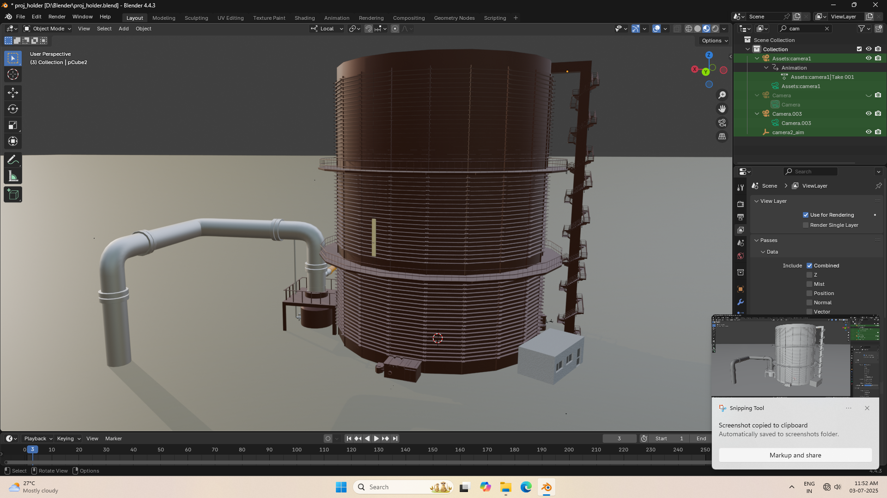

# Gas Holder VR Visualization

**Author:** Tarun Kumar Arumugam  
**Platform:** Unity, Blender, Autodesk Maya  
**Project Type:** Industrial VR Visualization

---

## Overview

This project provides an interactive, real-time VR simulation of a gas holder facility. The 3D modeling and asset creation used both Autodesk Maya and Blender. The final assets were integrated into Unity for immersive VR visualization that can be experienced either in VR hardware or explored within the Unity Editor.

---

## Project Contents

- **Screenshots/**: Demo images of the VR project and workflow  
- **Scripts/**: Example Unity scripts (if applicable)  
- **README.md**: This documentation  
- **External Assets** (provided via cloud links — see below)

---

## Download Links (Main Project Assets)

Below are the main asset download links, hosted on Google Drive due to their size:

| Asset Description         | File Type      | Download Link                                                                                           |
|--------------------------|----------------|--------------------------------------------------------------------------------------------------------|
| Blender model file        | `.blend`       | [Download .blend file](https://drive.google.com/file/d/1ya3RQJzBqjEr_U5nc2m4NFwi_6Pnrc_O/view?usp=sharing)        |
| Unity project (editable)  | `.7z` archive  | [Download Unity project 7z](https://drive.google.com/file/d/1i_pCjP0a19inOLzu3m_tuB9zLEYPGHr5/view?usp=sharing)  |
| VR Build (Ready-to-run)   | `.7z` archive  | [Download VR application](https://drive.google.com/file/d/1THIqmpl2Qpaso1iAayNimebGS_G2-4sF/view?usp=sharing)    |

---

## How to Use

1. **View the 3D Model (.blend):**  
   - Download and open in Blender (recommended version: 2.8 or above).

2. **Develop or Edit the Project (Unity):**  
   - Download the Unity Project 7z file and extract it.  
   - Open the folder in Unity (recommended version: 2021.x or above).  
   - All sources and scenes are included.  
   - If any packages are missing, use Unity’s Package Manager to restore them.

3. **Run the VR Application:**  
   - Download the built application archive.  
   - Extract and run the executable in the build folder (`.exe`, `UnityPlayer`, etc.).  
   - VR headset recommended, desktop mode may also be available.

---

## Screenshots

| Step | Description                                       | Preview                                     |
|------|---------------------------------------------------|---------------------------------------------|
| 1    | Blender: Wireframe view of 3D model               |    |
| 2    | Blender: Model without materials/colors           |        |
| 3    | Blender: Model with materials and colors applied  |    |
| 4    | Autodesk Maya: Nearly complete model view         |      |
| 5    | Autodesk Maya: Alternate model view               |  |
| 6    | Unity Editor: Scene setup with imported model     |         |
| 7    | Final VR App: In-game view with VR hands          |          |

---

## Credits

- **3D Modeling:** Autodesk Maya, Blender by Tarun Kumar Arumugam
- **VR Programming & Implementation:** Unity by Tarun Kumar Arumugam
- **Internship / Mentorship:** Mr. Harshit Bhatt, AMNS India Hazira

---

## Notes

- Autodesk Maya and Blender were both used in the modeling process; Maya source files are not included in this repository.
- Due to size constraints, all main assets are available only via the links above.
- If you have issues downloading, please contact the author by email or request access.
